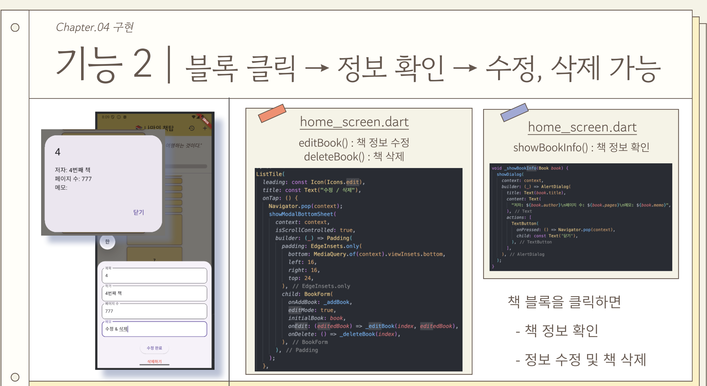
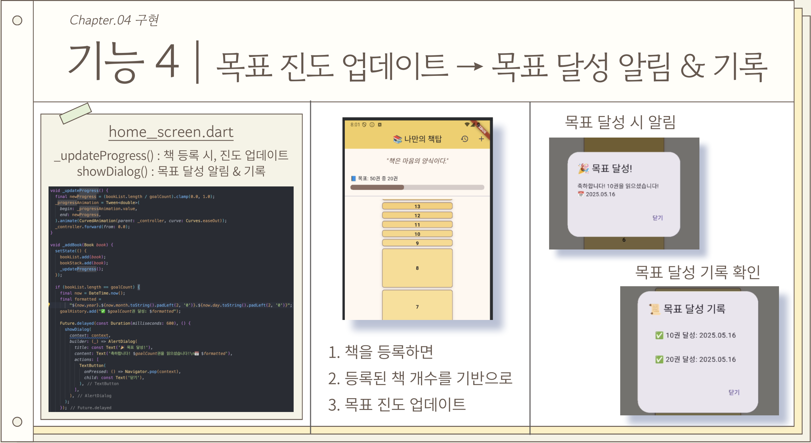

## 2025-1 자료구조 D반 5조 - 나만의 책탑

### 주제: 자료구조 기반 독서 기록 시각화 앱

### 주요 기능
- 책 시각화(List): 입력한 책 정보의 페이지 수를 기반으로 블록 쌓기

  

- 팝업 정보: 책 블록 클릭 시 상세 정보 확인 기능

  
  
- 명언(List): 메인 상단에 명언이 20초마다 전환되며 출력

  

- 목표: 목표에 따른 진행 막대와 달성 여부 알림

  

### 조원별 역할 분담
- 신정환: 책 등록 및 입력 처리 기능 구현
- 윤소운: 데이터 처리 및 삭제 로직
- 임석민: 목표 및 진행률 표시 로직
- 서현아: 명언 출력 및 디자인

### 개발 환경
- Flutter: 앱 개발 프레임워크
- VSCode: 코드 작성
- Android Studio: 에뮬레이터

### 시연 영상: [youtube 링크](https://youtube.com/shorts/WDhXVpSydcY?feature=share)

    

### 문제점 및 해결 방안
1. 개발 환경 세팅: 팀원 모두 처음 사용하는 개발 툴로, 특히 SDK관련 오류 발생
   - 다양한 개발 환경 세팅 방법을 참고해 SDK의 올바른 경로 설정
2. 디자인 작업 시 기능 오류: 기능 개발 후 디자인 요소 추가 시 기존 기능이 정상 작동하지 않음
   - 오류가 없었던 버전으로 돌아가 디자인 요소를 하나씩 추가
